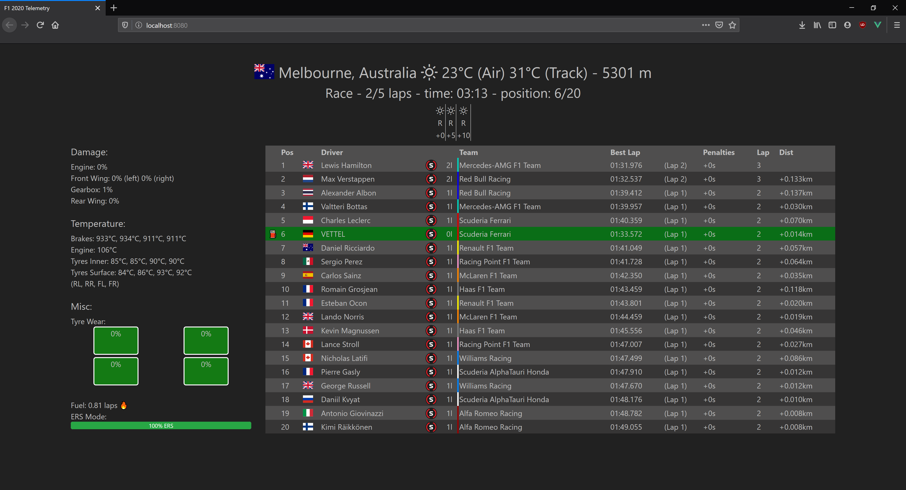

# Go F1 Telemetry

A telemetry server for F1 2020 to display it on a second screen. I started it
as a side project to learn about UDP packets and JavaScript, but it turned
out pretty useful and my friends liked it, so I made it public. So don't be
surprised by small bugs or missing features as I am a lousy web developer.

It doesn't make you any faster (unfortunately), but it does provide some
useful information when you take a quick peek on your second screen. Some
example features:

- Colored tyre wear to quickly see it
- Remaining session time in practice and qualifying
- Weather forecast
- ...



## Build

To build you need at least [Go](https://golang.org/) 1.16 installed and on
Linux also the following packages for systray support (depends on your distro,
these are for Fedora 34):

- gtk3-devel
- libappindicator-gtk3-devel

To build the project just execute

```sh
$ go build
```

## Run

To actually make it work you need to enable telemetry in your game. To do that,
go to the settings menu, telemetry settings and enable UDP telemetry. You
should stay with the 20 Hz frequency as I haven't tested higher ones.

Double-click the telemetry.exe to start, it will then sit in your lower-right
tray bar. Right-click to open the UI in your web browser.
You can also run this on another PC, just change the IP address and make
sure port 20777 is allowed in your firewall.

## Components & Libraries

Used 3rd party components:

- Bootstrap: [https://getbootstrap.com/]
- Flags: [https://github.com/lipis/flag-icon-css]
- Weather icons: [https://github.com/erikflowers/weather-icons]
- Moment.js: [https://github.com/moment/moment]
- Vue.js: [https://github.com/vuejs/vue]
- Reconnecting websocket: [https://github.com/joewalnes/reconnecting-websocket]
